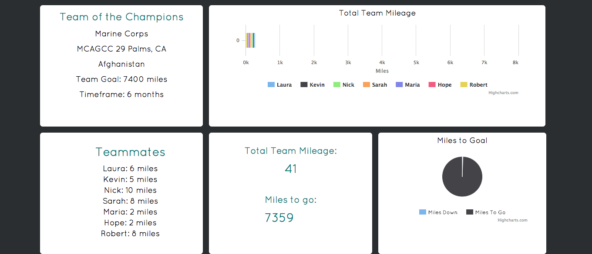
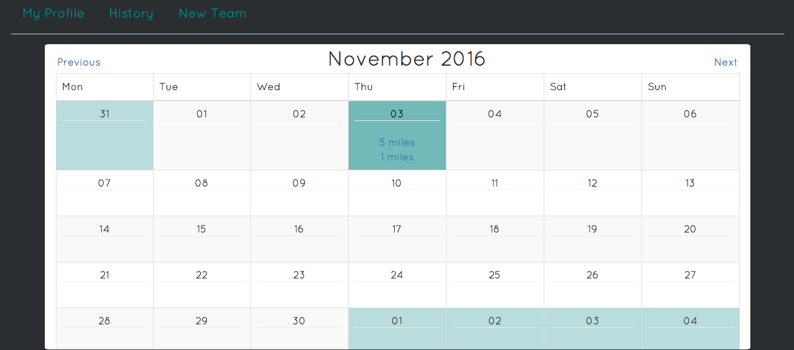
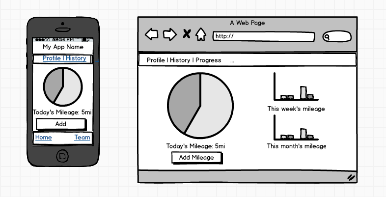
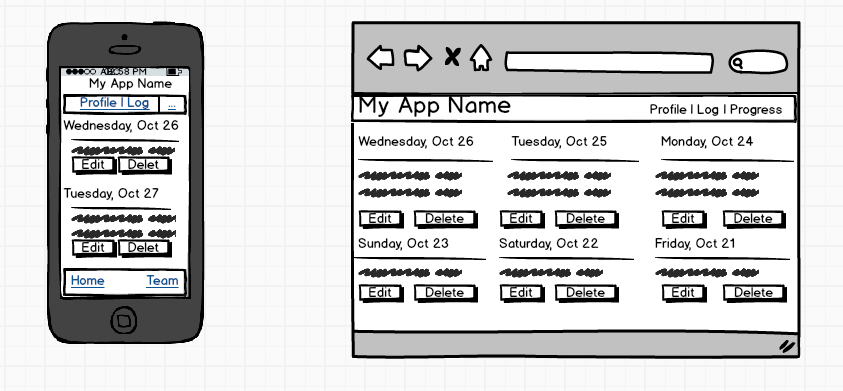

# A Few Short Miles

###Motivation & Users
A Few Short Miles is a an app I created for military families and friends to uphold a strong community through team-focused exercise while a loved one is deployed.  Users specify their home base and their loved one's deployment location upon creating an account, which then filters out what teams they can join so that their teammates are within their own community. Each user logs however many miles they've achieved that day via walking, running, biking, swimming, and so forth, which then contributes to their team's overall mileage. Each team’s goal is to reach the number of miles between their home base and the location of their loved one’s deployment.

By setting goals and keeping teammates accountable for contributing miles, this app helps users keep busy, keep connected with their community, benefits in their physical fitness, and helps keep their mental health stable, all of which are vital when working your way through a deployment.

###Technologies Used
* PostgreSQL
* Ruby on Rails
* Simple Calendar Gem
* HighCharts Gem
* Bcrypt Gem
* Javascript
* jQuery
* Bootstrap

###Planning:

####User Stories:

[Trello](https://trello.com/b/hAzn52LM/final-project)

####ERD:

####Mockups:

