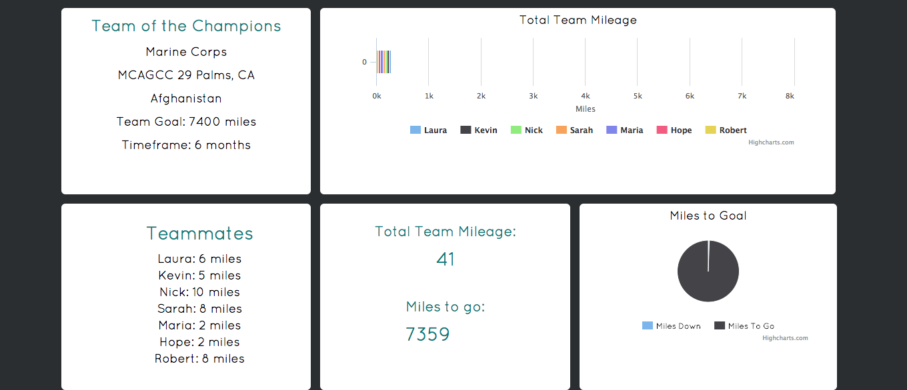
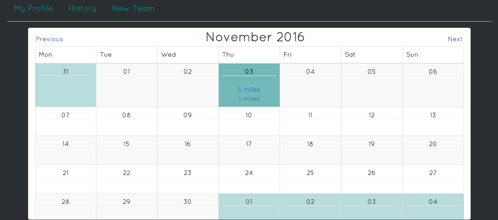
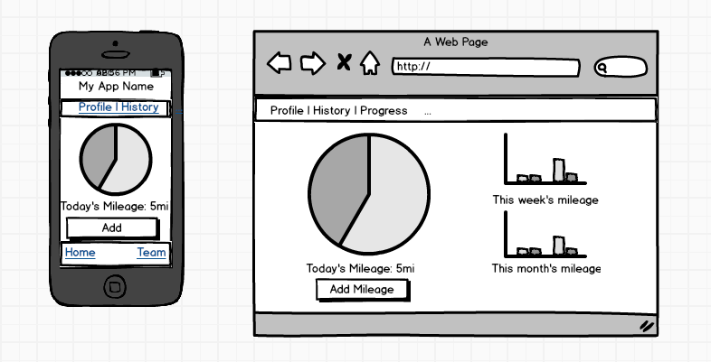
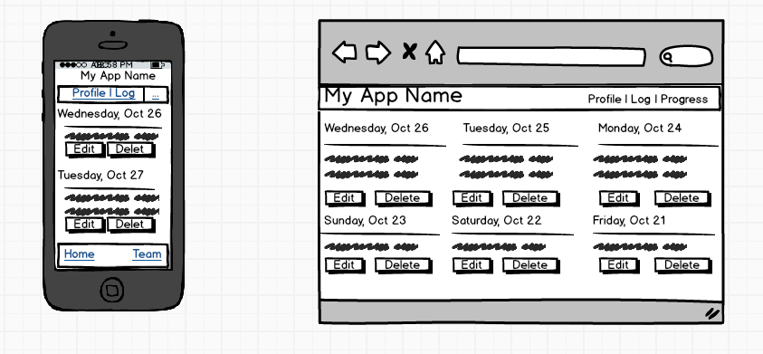

# A Few Short Miles

###Motivation & Users
A few short miles is a an app created for family and friends of a deployed loved one in the military. Users sign up, join a team made up of users on their home base who are currently starting the same deployment, and collectively keep track of how many miles they run, bike, swim, or walk each day. Each team’s goal is to reach the number of miles between their home base and the location of their loved one’s deployment.

By setting goals and keeping teammates accountable for contributing miles, this app helps users keep busy, keep connected with their community, benefits in their physical fitness, and helps keep their mental health stable, all of which are vital when working your way through a deployment.

###Technologies Used
* PostgreSQL
* Ruby on Rails
* Simple Calendar Gem
* HighCharts Gem
* Bcrypt Gem
* Javascript
* jQuery
* Bootstrap

###Planning:

####User Stories: [Trello](https://trello.com/b/hAzn52LM/final-project) 

####Mockups:

